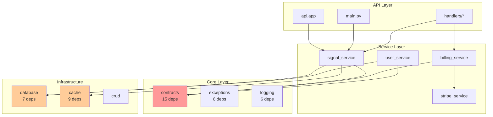
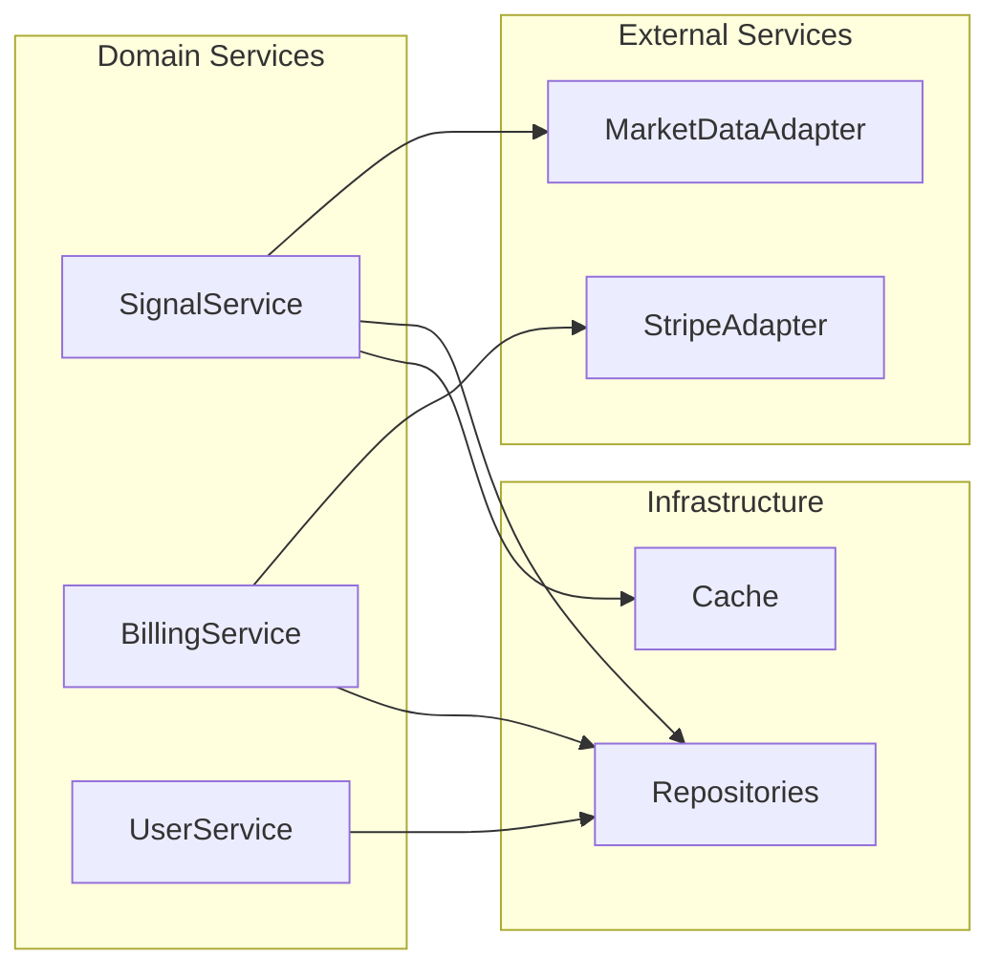

# Dependency Optimization Report

## Executive Summary
Analysis of the investment_system codebase reveals a well-structured architecture with an overall quality score of **7.5/10**. No circular dependencies were detected, but several optimization opportunities exist to improve maintainability and reduce coupling.

## Critical Findings

### 1. Dependency Bottlenecks
**High-Risk Modules** (changes impact many components):
- **`core.contracts`**: 15 dependents - Central data models
- **`cache`**: 9 dependents - Caching layer
- **`infrastructure.database`**: 7 dependents - Database models

### 2. Module Coupling Analysis



## Optimization Recommendations

### Priority 1: Reduce Core.Contracts Coupling
**Current State**: Single module with 15 dependents containing all domain models
**Target State**: Split into focused domain modules

**Action Plan**:
```python
# Before (single file):
core/contracts.py  # 15 dependents

# After (domain-focused):
core/contracts/
    ├── __init__.py      # Re-export for compatibility
    ├── user.py          # User-related models
    ├── trading.py       # Trading signals, indicators
    ├── billing.py       # Subscription, billing models
    └── market.py        # Market data models
```

**Benefits**:
- Reduced blast radius for changes
- Better code organization
- Easier testing and maintenance

### Priority 2: Implement Dependency Injection

**Current State**: Direct imports throughout services
**Target State**: Dependency injection container

**Implementation**:
```python
# src/investment_system/core/container.py
from dependency_injector import containers, providers

class Container(containers.DeclarativeContainer):
    config = providers.Configuration()
    
    # Infrastructure
    database = providers.Singleton(
        DatabaseSession,
        connection_string=config.database.url
    )
    
    cache = providers.Singleton(
        CacheClient,
        redis_url=config.cache.url
    )
    
    # Services
    signal_service = providers.Factory(
        SignalService,
        database=database,
        cache=cache
    )
```

**Benefits**:
- Easier testing with mock dependencies
- Reduced coupling between layers
- Better configuration management

### Priority 3: Service Layer Refactoring

**Issues Identified**:
- Service interdependencies (billing → stripe → subscription_monitor)
- Mixed responsibilities in some services

**Recommended Service Architecture**:


### Priority 4: API Consolidation

**Current State**: Two API entry points
- `api.py` (legacy FastAPI)
- `main.py` (new structure)

**Action**: Consolidate to single entry point
```python
# Remove api.py, enhance main.py
src/investment_system/main.py  # Single API entry
src/investment_system/api/
    ├── v1/          # Version 1 endpoints
    ├── v2/          # Future version
    └── middleware/  # Shared middleware
```

## Implementation Roadmap

### Phase 1: Foundation (Week 1)
- [ ] Create dependency injection container
- [ ] Add container configuration
- [ ] Update main.py to use container

### Phase 2: Contract Splitting (Week 2)
- [ ] Create contract submodules
- [ ] Migrate existing imports gradually
- [ ] Maintain backward compatibility

### Phase 3: Service Refactoring (Week 3-4)
- [ ] Refactor services to use DI
- [ ] Remove service interdependencies
- [ ] Implement adapter pattern for external services

### Phase 4: API Consolidation (Week 5)
- [ ] Migrate api.py functionality to main.py
- [ ] Remove duplicate code
- [ ] Update documentation

## Metrics for Success

### Before Optimization
- **Coupling Score**: 7.5/10
- **Most Coupled Module**: core.contracts (15 deps)
- **Service Dependencies**: 3-10 per service
- **API Duplication**: 2 entry points

### Target After Optimization
- **Coupling Score**: 9/10
- **Most Coupled Module**: <5 dependencies
- **Service Dependencies**: 2-4 per service
- **API Duplication**: 1 entry point

## Testing Strategy

### Unit Testing
```python
# With DI, testing becomes simple
def test_signal_service():
    mock_db = Mock()
    mock_cache = Mock()
    
    service = SignalService(
        database=mock_db,
        cache=mock_cache
    )
    
    # Test without real dependencies
    result = service.generate_signal("AAPL")
    assert result.symbol == "AAPL"
```

### Integration Testing
- Test each layer independently
- Use test containers for dependencies
- Validate contract changes don't break consumers

## Risk Mitigation

### Backward Compatibility
- Keep original imports working during transition
- Use `__init__.py` to re-export moved modules
- Deprecation warnings for old patterns

### Gradual Migration
- Start with low-risk modules
- Test thoroughly at each step
- Monitor application metrics

### Rollback Plan
- Git tags at each phase completion
- Feature flags for new patterns
- Parallel running of old/new code

## Conclusion

The codebase has a solid foundation but can benefit significantly from:
1. **Reducing coupling** in core.contracts
2. **Implementing dependency injection**
3. **Consolidating API patterns**
4. **Refactoring service dependencies**

These optimizations will improve:
- **Maintainability**: Easier to modify and extend
- **Testability**: Simpler unit and integration tests
- **Performance**: Better caching and resource usage
- **Developer Experience**: Clearer code organization

**Estimated Timeline**: 5 weeks
**Risk Level**: Low-Medium (with gradual migration)
**ROI**: High - Reduced maintenance costs, faster feature delivery