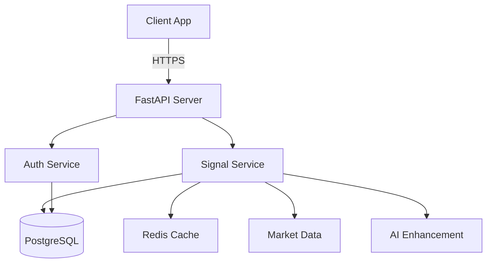

# System Architecture

## Overview
The Investment System is a modular, AI-ready trading signal platform built with security and scalability in mind.

## Core Architecture Principles

### 1. Separation of Concerns
- **API Layer:** FastAPI handles HTTP requests and responses
- **Service Layer:** Business logic and orchestration
- **Core Layer:** Domain models and contracts
- **Infrastructure Layer:** Database, cache, external services

### 2. Security First
- All secrets in environment variables
- Argon2 password hashing
- JWT with short expiration
- Comprehensive audit logging
- Rate limiting per tier

### 3. AI-Ready Design
- Pluggable analyzer system
- Hooks at decision points
- Dependency graph for safe modifications
- Cached results for performance

## Component Architecture



## Module Structure

### API Layer (`src/investment_system/api/`)
- **app.py:** Main FastAPI application
- Handles authentication, rate limiting, CORS
- Routes requests to appropriate services

### Core Layer (`src/investment_system/core/`)
- **contracts.py:** Pydantic models for data validation
- **analyzers.py:** Pluggable analysis system with AI hooks

### Service Layer (`src/investment_system/services/`)
- **signal_service.py:** Trading signal generation
- Orchestrates data fetching, analysis, and caching

### Infrastructure Layer (`src/investment_system/infrastructure/`)
- **database.py:** SQLAlchemy models and connection management
- **cache.py:** Redis caching with fallback
- **crud.py:** Database operations with security

### Security Layer (`src/investment_system/security/`)
- **password.py:** Argon2 hashing and token generation
- API key management and rotation

### Pipeline Layer (`src/investment_system/pipeline/`)
- **ingest.py:** Market data fetching with retry logic
- **analyze.py:** Technical indicator calculation

## Database Schema

### Core Tables
- **users:** User accounts with secure password storage
- **subscriptions:** Billing and tier management
- **signals:** Generated trading signals
- **api_usage:** Usage tracking for billing
- **audit_logs:** Security and compliance logging
- **market_data:** Cached market prices

### Security Features
- UUID primary keys
- Indexed foreign keys
- Audit timestamps on all tables
- Soft deletes where appropriate

## API Design

### Authentication Flow
1. User registers/logs in with email/password
2. Server validates credentials (Argon2)
3. Server issues JWT token (24h expiry)
4. Client includes token in Authorization header
5. Server validates token on each request

### Rate Limiting Strategy
- **Free:** 100 calls/hour, 5 symbols
- **Starter:** 1,000 calls/hour, 20 symbols
- **Pro:** 10,000 calls/hour, 100 symbols
- **Enterprise:** Unlimited

### Caching Strategy
- **L1 Cache:** In-memory LRU (immediate)
- **L2 Cache:** Redis (10 min TTL)
- **L3 Cache:** Database (permanent)
- Cache key includes user tier for differentiation

## Deployment Architecture

### Development
```
Local Machine
├── SQLite Database
├── In-Memory Cache
└── Single Process
```

### Production
```
Load Balancer
├── API Server 1-N (Kubernetes)
├── Redis Cluster
├── PostgreSQL (Primary + Replica)
└── Monitoring Stack
```

## Security Architecture

### Defense in Depth
1. **Network:** HTTPS only, firewall rules
2. **Application:** Input validation, SQL injection prevention
3. **Authentication:** JWT, API keys, MFA ready
4. **Authorization:** Role-based access control
5. **Data:** Encryption at rest and in transit
6. **Monitoring:** Audit logs, anomaly detection

### Secret Management
- Development: .env file (gitignored)
- Production: HashiCorp Vault or AWS Secrets Manager
- Rotation: Monthly for API keys, quarterly for master secrets

## Performance Targets

| Metric | Target | Current |
|--------|--------|---------|
| API Latency (p50) | <100ms | TBD |
| API Latency (p99) | <500ms | TBD |
| Cache Hit Rate | >80% | TBD |
| Database Query Time | <50ms | TBD |
| Concurrent Users | 1000+ | TBD |

## Monitoring & Observability

### Metrics (Prometheus)
- Request rate, latency, errors
- Cache hit/miss ratio
- Database connection pool
- Business metrics (signals generated, revenue)

### Logging (Structured JSON)
- Application logs
- Audit logs
- Security events
- Performance traces

### Alerting
- API errors > 1%
- Latency > 1s
- Database connection failures
- Security anomalies

## Future Enhancements

### Phase 2: Revenue Features
- Stripe payment integration
- Usage-based billing
- Customer portal
- Invoice generation

### Phase 3: Production Readiness
- Kubernetes deployment
- Auto-scaling
- Disaster recovery
- Compliance (SOC2)

### Phase 4: AI Integration
- Claude API for signal enhancement
- ML model training pipeline
- A/B testing framework
- Explainable AI dashboard